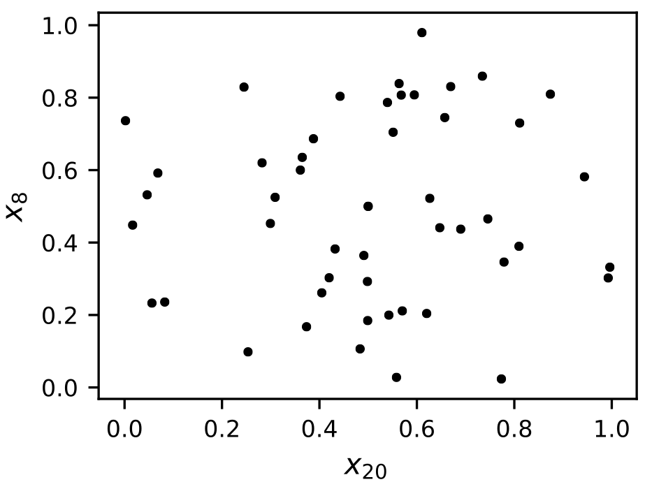
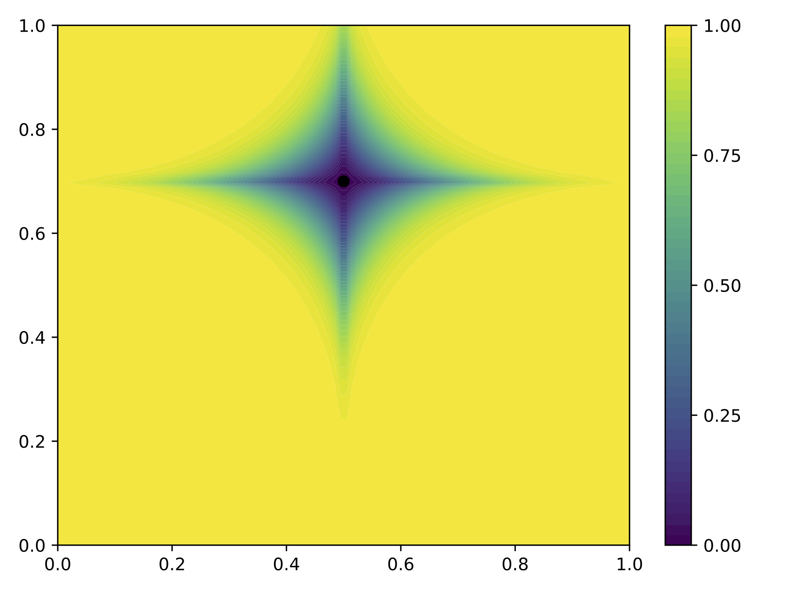
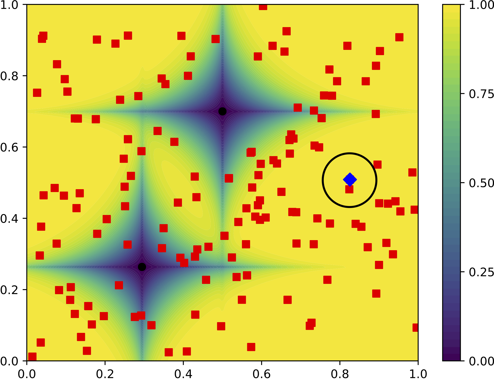

.. image:: https://img.shields.io/badge/python-3.6-blue.svg

KD0E
====

What is it?
-----------

This project implements a new stochastic, iterative Design of Experiments (DoE)
based on a modified Kernel Density Estimation (KDE) [Roy2019]_.

It is a two-step process: *(i)* candidate samples are generated using MCMC based
on KDE, and *(ii)* one of them is selected based on some metric. The performance
of the method is assessed by means of the :math:`C^2`-discrepancy space-filling
criterion. KDOE appears to be as performant as classical one-shot methods in low
dimensions, while it presents increased performance for high-dimensional parameter
spaces. This work proposes a new  methodology to stochastically sample the input
parameter space iteratively allowing, at the same time, to take into account any
constraint, such as non-rectangular DoE, sensitivity indices or even constraint
on the quality on particular subprojections. It is a versatile method which
offers an alternative to classical methods and, at the same time, is easy to
implement and offers customization based on the objective of the DoE.

.. code-block:: python

    sampler = KdeSampler(dim=50)
    sample_kde = sampler.generate(n_samples=30)

Following is an 2-dimensional subprojection of the sample of size 50 in dimension 30: 

How does it work?
-----------------

Assuming that a group of sample is already computed, the PDF of the sample is estimated
by KDE. This estimator is reversed so that the probability close to the existing
samples is low and the probability in empty area is high. Moreover, the distance
function used in the KDE is modified to use a Minkowsky distance. This modification
allows to lower the probability on a given axis.

Then, using a MCMC sampling on this KDE field, a given number of sample is generated.
On point is selected based on a given metric (here the :math:`C^2`-discrepancy).

Requirements
------------

The dependencies are: 

- Python >= 2.7 or >= 3.5
- `scikit-learn <http://scikit-learn.org>`_ >= 0.18
- `numpy <http://www.numpy.org>`_ >= 0.13
- `scipy <http://scipy.org>`_ >= 0.15

References
----------

.. [Roy2019] Versatile Adaptive Sampling Algorithm using Kernel Density Estimation.
  Pamphile T. Roy, L. Jofre, J.C. Jouhaud, B. Cuenot. 2019
